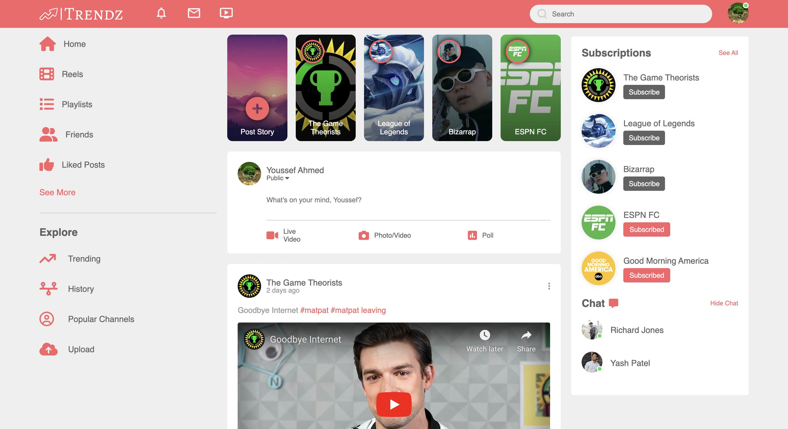
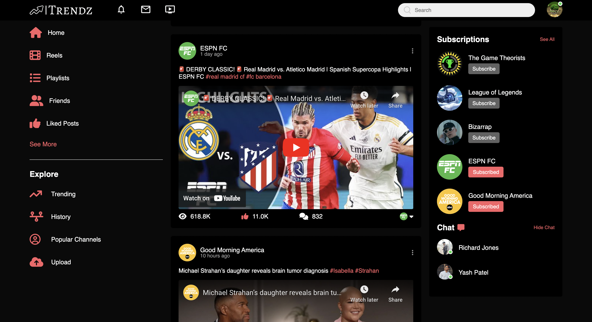

# Trendz

A social media website that showcases trending YouTube content, where users can interact with video posts and channels. It uses the YouTube Data API v3 to retrieve and display trending videos, popular channels, and user subscriptions.

## Table of Contents

- [Demo](#demo)
- [Features](#features)
- [Installation](#installation)
- [Technologies Used](#technologies-used)
- [Future Implementations](#future-implementations)

## Demo

[Watch The Demo - Click Me!](src/assets/README-imgs/Trendz-Demo.mp4)

Media:





## Features

- Home Page:
  - Embedded YouTube videos in video posts
  - Interactive like button
  - Dark/light mode for home page
- Subscriptions:
  - Name of YouTube channel is a link to official channel page
  - Interactive subscribe/unsubscribe button
- Dropdown settings menu when profile image is clicked

## Installation

To get started with Trendz, follow these steps in your terminal:

1. **Clone the Repository:**

   First, clone the Trendz repository to your local machine using Git:

   ```bash
   git clone https://github.com/youssefahmed04/Trendz.git

   ```

2. Navigate to the project directory

   ```bash
   cd Trendz
   ```

3. Install Dependencies:

   ```bash
   npm install --save-dev parcel
   ```

4. Start the Development Server:

   You can now start the development server to run Trendz locally:

   ```bash
   npm run start
   ```

   This will launch the application on your local machine, and you can access it in your web browser at http://localhost:1234.

5. Explore Trendz:

   Open your web browser and go to http://localhost:1234 to access Trendz. Start exploring and enjoying the features!

## Technologies Used

- HTML
- CSS
- JavaScript (ES6+)
- YouTube Data API v3 - REST APIs

## Future Implementations

Planning to add a profile page in the next commit
